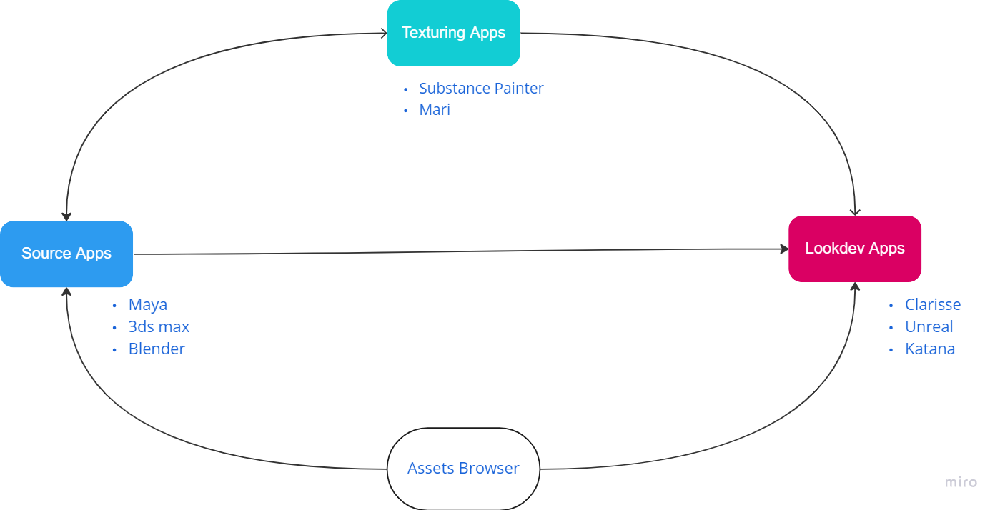

Djed Tools
====

Introduction
------------

Open-source assets pipeline for visual effects, animation and games. Djed connects all workflow of assets in DCCs with
sockets, it uses database to save the asset information and provide an assets browser and connect it with all DCCs.
Djed provide some facilities to assets workflow like assets validation and assets browser to reuse asset anywhere.

Djed provide to you all sources and the database locally to manage it as well as the full control to customize every
thing through global settings.

[**Get more information**](docs/basic_doc.md)

[**Fast demo video**](https://vimeo.com/775184392)

Requirements
------------

Djed trying to follow [**VFX Reference Platform**](https://vfxplatform.com/)

Djed is written in python 3, and use [**pyblish**](https://github.com/Michaelredaa/Djed/releases) concepts in publishing

Installing
------------
Go to [**GitHub releases**](https://github.com/Michaelredaa/Djed/releases)  and download the latest build executable and
install it with regular way.

Build
------------
build `start.py` with [**cx-freeze**](https://cx-freeze.readthedocs.io/en/latest/index.html)

To make installer use [**Inno**](https://jrsoftware.org/) with configuration file `create_djed_executable.iss`

Testing
------------
Due to following of [**VFX Reference Platform**](https://vfxplatform.com/) tests run on `Maya 2023` `substance Painter 8.1` `Clarisse 5 SP8`

Contribution
------------
[**Ideas board**](https://miro.com/app/board/uXjVOmTmOgU=/?share_link_id=212362301029)

Ideas and any kind of contributions or feedback are welcome!
