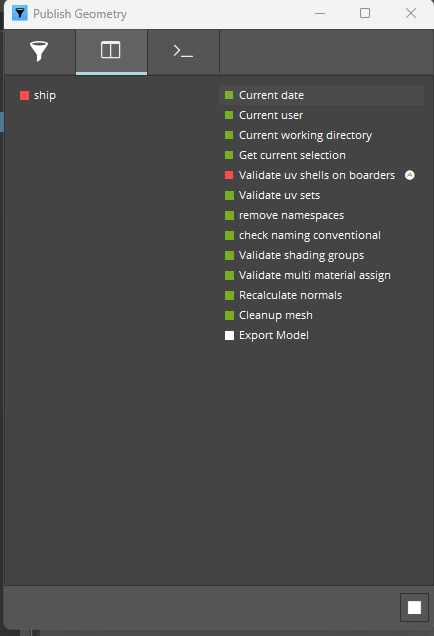
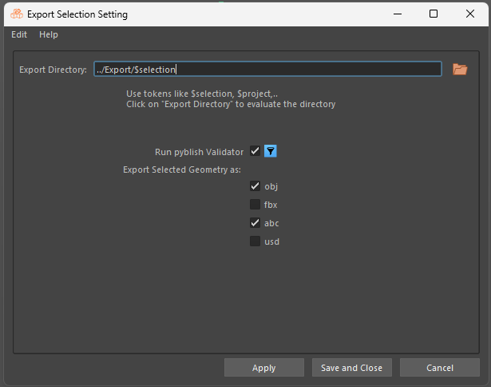
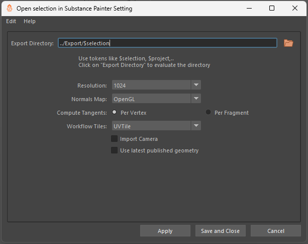
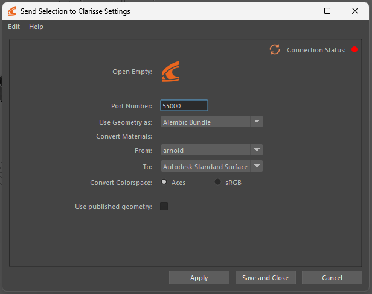
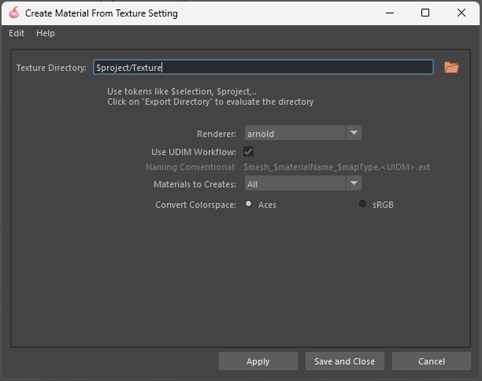
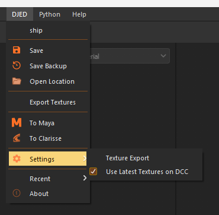
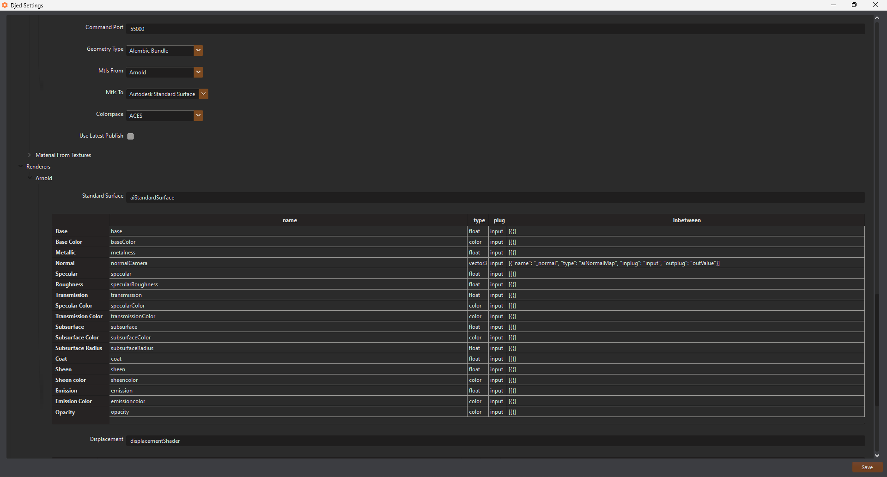
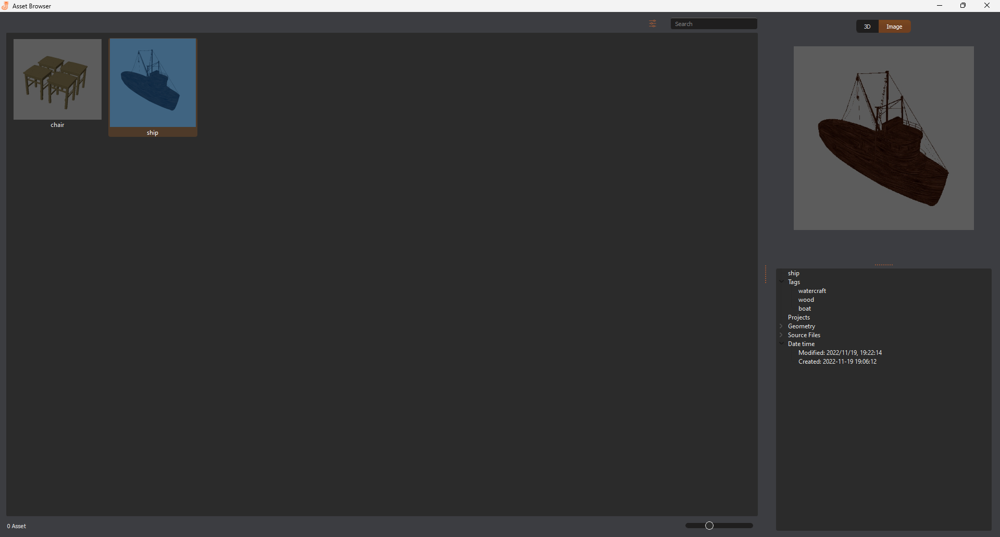
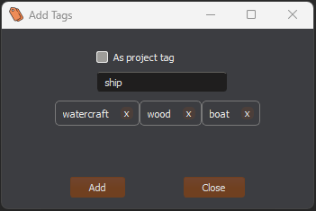

Djed serves the asset workflow across various application, it designed to extended and support more applications.

Source Applications
-------------------
source application is the applications that can make the source of geometry of asset with its UVs and shading engines.

*Maya* is an example of source applications.

Maya is implemented with some plugins that can help in make asset ready to the next step,
like validate of geometry, UV shells, UV sets, ...

Djed use [**pyblish**](https://pyblish.com/) to validate on model.

Providing some options on publish the geometry.

With others applications

Texturing Applications
-------------------
Texturing application is the applications that can make the texturing of geometry

*Substance Painter* is an example of texturing applications.

Substance painter is implemented to saving files and export textures with automatic versions, and directly connected to
other application

Look Development and Rendering Applications
-------------------
Applications that can finally use the asset to render it

*Clarisse* is implemented to receive the final asset from anywhere.

It can be use more than renderer materials inside clarisse.

*Maya* can be used as lookdev application with multiple renderer materials

Settings
-------------------
Everything can be configured with a global settings.

Assets Browser
-------------------
The latest step of any stage of asset is stored in database, then it appears in assets browser.

It can be tag asset, preview and get all information and send it to an opened application through standalone asset
browser.

